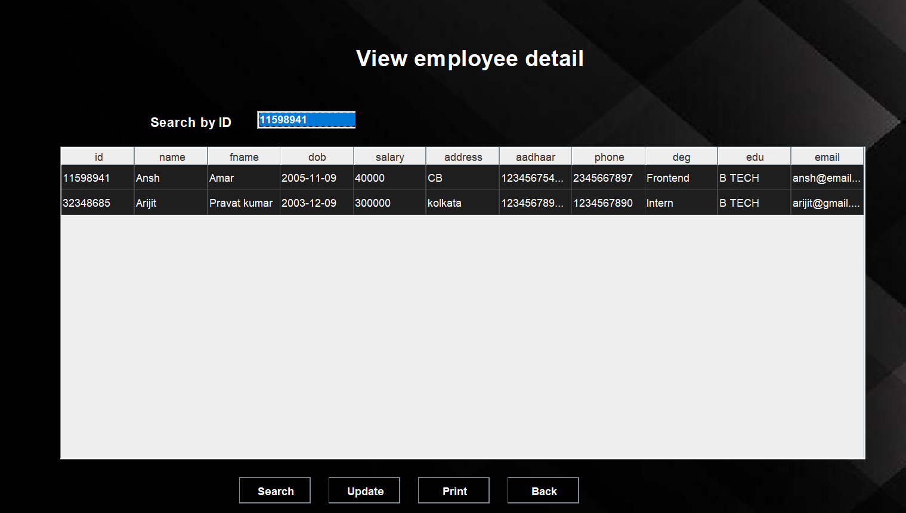
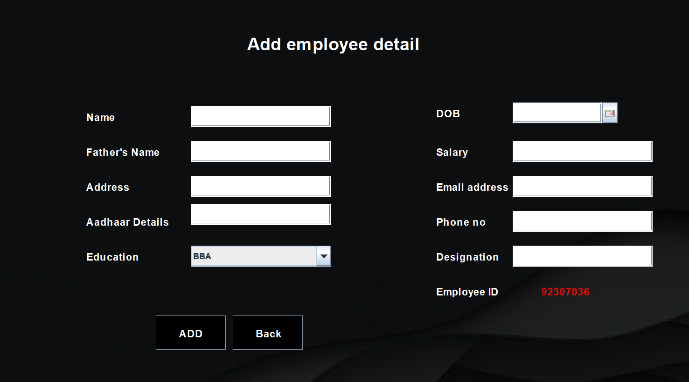

# 🧑‍💼 Staff Sphere – Employee Management System

A **Java Swing desktop application** for managing employee records with full CRUD functionality, powered by a **MySQL database** and packaged as a runnable **JAR**.

---

## 🚀 Features
- Add new employees
- View employee details in a table
- Update existing employee records
- Remove employees
- MySQL database integration
- Runnable standalone JAR

---

## 🖥 Screenshots

### 📋 View Employees


### ➕ Add Employee


---

## 📦 Download

### ▶️ Runnable JAR
👉 **[Download Staff Sphere JAR](https://github.com/USERNAME/REPO/releases/latest/download/Staff_Sphere.jar)**  
Requires **Java 8+** and **MySQL** installed.

### 🗄 Database Schema (SQL)
👉 **[Download employee.sql](database/employee.sql)**

---

## 🛠 Tech Stack & Skills Used
- Java (Core Java)
- Java Swing (Desktop UI)
- JDBC
- MySQL
- SQL (CRUD operations)
- IntelliJ IDEA
- Git & GitHub
- JAR packaging & GitHub Releases

---

## ⚙️ Setup Instructions

### Database Setup
1. Start MySQL server
2. Create database:
```sql
CREATE DATABASE employeedb;
mysql -u root -p employeedb < database/employee.sql
---
### 2️⃣ Run the Application

1. Make sure **MySQL server is running**
2. Ensure the database is already created and imported
3. Run the JAR using the command below:

```bash
java -jar Staff_Sphere.jar


### Requirements

- Java 8 or higher installed  
- MySQL running locally  
- Correct database credentials configured in the application


## 🎯 What This Project Demonstrates

- Java desktop application development  
- Real database integration using JDBC  
- CRUD operations with MySQL  
- Packaging Java applications into runnable JARs  
- Proper use of GitHub Releases  

---

## 📌 Notes

- Desktop application (not web-based)  
- Database setup is required before running  
- SQL schema is included for easy setup  
- Built for learning and demonstration purposes  

